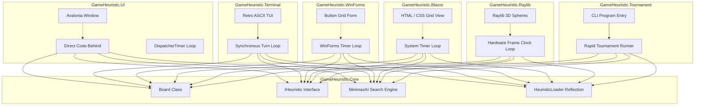
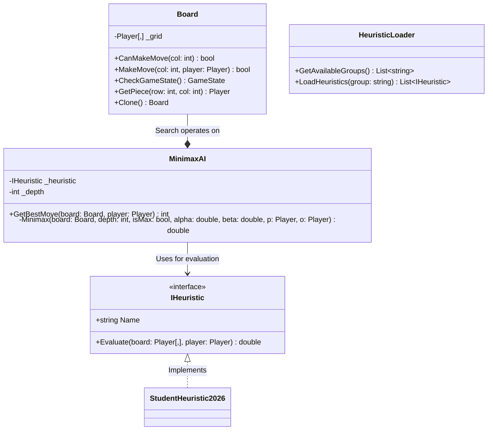
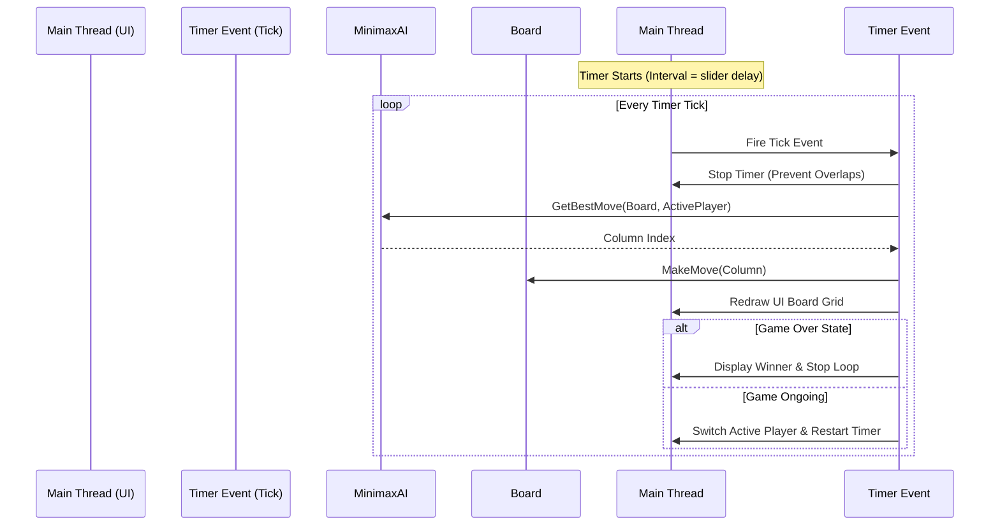

# Connect 4 Heuristic Framework: Technical Design Specification

This document serves as a comprehensive system design specification for the Connect 4 Heuristic Framework. It details the system architecture, data models, key algorithms, and design choices. It is designed to act as a model reference of what high-level technical documentation should contain for a Non-Exam Assessment (NEA).

---

## 1. System Architecture & Component Decoupling

The application is built using a **highly decoupled, modular multi-tier architecture** divided into one shared core engine library and five distinct frontend client applications. This strict separation of concerns guarantees that the core game rules and artificial intelligence remain completely independent of how the game is visualized, inputs are gathered, or platforms are targeted.



### Shared Engine Layer:
* **`GameHeuristic.Core` (Class Library):** Encapsulates the complete game logic (grid representation, turn-taking, win/draw detection), the `IHeuristic` interface contract, and the alpha-beta minimax search tree engine. It has **zero dependencies** on terminal inputs, graphical SDKs, web hosts, or hardware-accelerated libraries.

### Swappable Presentation Tiers (Clients):
1. **`GameHeuristic.UI` (Avalonia Desktop):** A graphical, event-driven desktop application using Avalonia. Renders the board directly using procedural XAML grid cells.
2. **`GameHeuristic.Terminal` (Console TUI):** A retro, text-only interactive CLI application. Renders the board using color-coded ASCII shapes in the command prompt.
3. **`GameHeuristic.WinForms` (Windows Forms):** A traditional desktop application. Renders the board as a grid of native Windows `Button` controls.
4. **`GameHeuristic.Blazor` (HTML Web App):** A modern Web application running on ASP.NET Core. Renders the board as an interactive HTML grid styled with CSS.
5. **`GameHeuristic.Raylib` (3D Hardware-Accelerated App):** A high-performance 3D desktop application. Renders the board using a 3D perspective camera and hardware-drawn **3D Spheres**.
6. **`GameHeuristic.Tournament` (Headless CLI):** A high-speed runner designed to run round-robin tournaments sequentially at maximum clock speed.

### 📚 Learning Resources:
* **Video:** [What is Separation of Concerns & Coupling in Software? (Developer Direction)](https://www.youtube.com/watch?v=0ZgXF6-rA24)
* **Tutorial:** [Introduction to C# Class Libraries (Microsoft Learn)](https://learn.microsoft.com/en-us/dotnet/core/tutorials/library-with-visual-studio)

---

## 2. Conceptual Data Model & Class Specification

The system uses strong typing, inheritance via interfaces, and decoupled models to coordinate state:



### Component Breakdown:
* **`IHeuristic` (Polymorphic Contract):** Defines a standard interface requiring a descriptive name and an `Evaluate` method. This acts as a mathematical evaluation contract.
* **`Board` (State Model):** Tracks pieces using row/column indexes, controls turn-taking, and validates state boundaries.
* **`MinimaxAI` (Search Engine):** Traverses the game decision tree recursively up to a given depth and evaluates leaf nodes using the injected heuristic.
* **`TournamentResult` (Data Structure):** A lightweight C# struct/class used to hold tournament statistic metrics (Wins, Losses, Draws, Scores) for direct UI rendering.

### 📚 Learning Resources:
* **Video:** [Polymorphism & Interfaces in C# Explained (Mosh Hamedani)](https://www.youtube.com/watch?v=EpGNcUB99pM)
* **Tutorial:** [Classes, Structs, and Interfaces in C# (W3Schools)](https://www.w3schools.com/cs/cs_classes.php)

---

## 3. Data Structures & Representation Justifications

Selecting appropriate data structures is fundamental to high scoring design document sections:

| Data Structure | Implementation | Purpose & Justification |
| :--- | :--- | :--- |
| **2D Fixed Array** | `Player[Rows, Columns]` | Represents the Connect 4 grid (`6 rows, 7 columns`). We use a 2D array over list arrays because the grid is **fixed size** and doesn't resize during runtime. Lookup is exceptionally fast ($O(1)$) and coordinates map directly to cartesian matrix positions `[r, c]`. |
| **State Enumerations** | `enum Player`, `enum GameState` | Replaces magical constants or string variables with **strongly-typed state options** (`Player.Red`, `Player.Yellow`, `Player.None`). This prevents spelling errors, strictly limits options to compiler-enforced values, and simplifies logic matching. |
| **Standard Lists** | `List<IHeuristic>` | Stores dynamic lists of loaded submission entries. Chosen for high-speed linear iteration when iterating over participants. |
| **Lookup Dictionary** | `Dictionary<string, Stats>` | Maps competitor names to their results statistics. Used for $O(1)$ high-speed lookup when incrementing match scores under multi-threaded tournament loops. |

### 📚 Learning Resources:
* **Tutorial:** [C# Multi-Dimensional Arrays Guide (Microsoft Learn)](https://learn.microsoft.com/en-us/dotnet/csharp/programming-guide/arrays/multidimensional-arrays)
* **Tutorial:** [Enums in C# (GeeksforGeeks)](https://www.geeksforgeeks.org/c-sharp-enum-with-examples/)

---

## 4. Dynamic Loading via Reflection (Inversion of Control)

In traditional systems, adding a new student heuristic requires modifying the main game runner to import and instantiate the new class. This creates **tight coupling** and maintenance overhead.

To prevent this, the framework implements **dynamic assembly discovery (Reflection)** inside `HeuristicLoader.cs`:

```csharp
IEnumerable<Type> types = AppDomain.CurrentDomain.GetAssemblies()
    .SelectMany(s => s.GetTypes())
    .Where(p => typeof(IHeuristic).IsAssignableFrom(p) && !p.IsInterface && !p.IsAbstract);
```

### How it works:
1. When the program starts, C# opens its own compiled binary (`Assembly`).
2. It queries all defined classes looking for any non-abstract class that implements `IHeuristic`.
3. It instantiates the discovered bots dynamically using `Activator.CreateInstance(type)`.
4. **Pedagogical Benefit:** Students can create a completely new C# file in their year-group folder, define their class, and the game instantly loads them into the dropdown menus without changing any core project files.

### 📚 Learning Resources:
* **Video:** [C# Reflection & Metadata Tutorial (tutorialsEU)](https://www.youtube.com/watch?v=yYsk_w8x0YI)
* **Tutorial:** [Introduction to C# Reflection (C# Corner)](https://www.c-sharpcorner.com/article/reflection-in-c-sharp/)

---

## 5. Adversarial Search: Minimax with Alpha-Beta Pruning

The core AI engine uses a classical search tree algorithm based on **Adversarial Game Theory**.

```text
                  Maximizing Node (Player's Turn)
                             /       \
                            /         \
              Minimizing Node         Minimizing Node (Opponent's Turn)
                   /     \                  /     \
                  /       \                /       \
               [10]       [5]           [-5]       [X] <- Pruned! (Beta Cutoff)
```

### The Minimax Search Concept
Minimax simulates every possible move up to $N$ turns ahead. It assumes the player wants to maximize their score (find the best move), while the opponent will play perfectly to minimize the player's score.

### Alpha-Beta Pruning Optimization
Searching every branch in Connect 4 down to depth 6 results in checking $7^6 = 117,649$ positions. **Alpha-Beta Pruning** dramatically reduces this search space:
* **Alpha ($\alpha$):** The best value the maximizing player is guaranteed to achieve.
* **Beta ($\beta$):** The best value the minimizing opponent is guaranteed to achieve.
* If at any point $\beta \leq \alpha$, it means the opponent can force a path that is worse than an alternative we already discovered. The algorithm instantly stops evaluating this branch (**prunes** it), saving massive computational time.
* **Complexity reduction:** Reduces the average search complexity from $O(b^d)$ down to $O(b^{d/2})$, effectively allowing the AI to search twice as deep in the same amount of time.

### Win/Loss Depth Weighting
In end-game scenarios, the AI can sometimes delay winning because a win in 1 move is mathematically scored the same as a win in 5 moves. We resolve this by incorporating `depth` into the terminal win score:
* **Favouring Quicker Wins:** `1000000 + depth` (wins higher up the tree have larger depth values, rewarding the AI for winning immediately).
* **Favouring Delayed Losses:** `-1000000 - depth` (penalizes quick losses, forcing the AI to block and survive as long as possible).

### Standard Algorithmic Pseudocode
```text
function minimax(node, depth, maximizingPlayer, alpha, beta) is
    if depth == 0 or node is terminal then
        return heuristic evaluation of node

    if maximizingPlayer then
        value := −∞
        for each child of node do
            value := max(value, minimax(child, depth − 1, FALSE, alpha, beta))
            alpha := max(alpha, value)
            if beta ≤ alpha then
                break (* Beta cutoff *)
        return value
    else
        value := +∞
        for each child of node do
            value := min(value, minimax(child, depth − 1, TRUE, alpha, beta))
            beta := min(beta, value)
            if beta ≤ alpha then
                break (* Alpha cutoff *)
        return value
```

### 📚 Learning Resources:
* **Video (Highly Recommended):** [Sebastian Lague's Minimax and Alpha-Beta Pruning Visualized](https://www.youtube.com/watch?v=l-hh51ncgDI)
* **Tutorial:** [Adversarial Search Algorithms (GeeksforGeeks)](https://www.geeksforgeeks.org/minimax-algorithm-in-game-theory/)

---

## 6. UI Engine: Single-Threaded Event Loop (Timer-Based)

Rather than using advanced multi-threaded tasks, the visual interfaces (Avalonia, WinForms, Blazor, and Raylib) implement **Single-Threaded Timer Loops** using platform-native clocks.



### How the Timer Loop keeps the UI responsive:
* Standard procedural loops freeze application interfaces because they lock the thread, preventing the operating system from updating the screen.
* The timer loops (e.g. `DispatcherTimer` in Avalonia, `System.Windows.Forms.Timer` in WinForms, `System.Timers.Timer` in Blazor, and standard Frame Clocks in Raylib) resolve this by executing **one turn per tick**, then immediately yielding execution back to the operating system/browser.
* Between ticks, the system is fully free to repaint the window, register mouse clicks, and adjust sliders.
* This entirely eliminates the need for `Task.Run()`, multithreading locks, asynchronous syntax, and cross-thread exceptions, making the graphical frontends accessible to students.

---

## 7. Alternative Designs Evaluation (Mark-Multiplier)

A key requirement in A-level design documentation is demonstrating critical evaluation by comparing chosen designs against alternatives:

### Alternative A: MVVM & Data Binding vs. Direct Code-Behind (GUI)
* **MVVM Design:** Relies on ViewModels, binding properties, and change notifications (`INotifyPropertyChanged`).
* **Direct Code-Behind (Chosen):** Dynamically populates named panel grids (`BoardGrid`, `ParticipantList`) and manipulates child controls directly in code.
* **Justification:** While MVVM is the modern enterprise standard, it introduces massive boilerplates (ViewModels, binding XAML converters) that confuse students. Direct manipulation uses simple, standard procedural code-behinds (loops, element assignments) that are 100% transparent and easy to trace.

### Alternative B: Asynchronous Tasks vs. DispatcherTimer Loops (Game Loops)
* **Async Threading:** Uses `Task.Run` to evaluate AI moves on background worker threads, yielding via `await Task.Delay()`.
* **DispatcherTimer (Chosen):** Fires a periodic event on the main UI thread.
* **Justification:** Asynchronous programming introduces highly complex concepts (concurrency, race conditions, marshalling UI updates back via dispatchers). A `DispatcherTimer` runs sequentially, is completely single-threaded, and maintains an extremely clear step-by-step game loop that perfectly matches what students learn about event-driven programming.

---

## 8. Directory & Project Structure

The project assets are organized cleanly by namespace and responsibility, providing students a model structure of scalable engineering:

```text
GameHeuristic/
├── GameHeuristic.sln               # Solution configuration file
├── RELEASE_NOTES.md                # Markdown release logs
├── DESIGN.md                       # System architecture design specs (This file)
├── GEMINI.md                       # Instructions on building submission classes
│
└── src/
    ├── GameHeuristic.Core/          # CORE ENGINE (Shared Class Library)
    │   ├── Board.cs                 # Tracks grid state, validates wins
    │   ├── Models.cs                # Player and GameState enums
    │   ├── MinimaxAI.cs             # Adversarial Search (Alpha-Beta pruning)
    │   ├── HeuristicLoader.cs       # Reflection & dynamic assembly scanner
    │   └── Submissions/             # SUBMISSIONS DIRECTORY (Compartmentalized)
    │       ├── Baselines/           # Dummy Baselines (Random, Center preference)
    │       ├── Teacher/             # Developer Benchmark Bosses (Expert)
    │       └── Y2026/               # Class of 2026 Student Submissions
    │
    ├── GameHeuristic.UI/            # CLIENT 1: Avalonia Desktop GUI
    │   ├── App.axaml / App.axaml.cs # Application entrypoint
    │   ├── MainWindow.axaml         # Simplified UI layouts (No bindings)
    │   └── MainWindow.axaml.cs      # Direct manipulation & Timer-based loop
    │
    ├── GameHeuristic.Terminal/      # CLIENT 2: Retro Console ASCII TUI
    │   └── Program.cs               # Color-coded ASCII board drawing & loop
    │
    ├── GameHeuristic.WinForms/      # CLIENT 3: Windows Forms UI (net8.0-windows)
    │   └── Program.cs               # Circular painted buttons, native WinForms timer
    │
    ├── GameHeuristic.Blazor/        # CLIENT 4: ASP.NET Core Blazor Web App
    │   ├── Program.cs               # Minimal WebServer boot config
    │   └── Components/App.razor     # Self-contained HTML/CSS & Blazor timer loop
    │
    ├── GameHeuristic.Raylib/        # CLIENT 5: Hardware 3D Game Engine (Raylib-cs)
    │   └── Program.cs               # 3D perspective camera, 3D spheres, frame-clock loop
    │
    └── GameHeuristic.Tournament/    # CLIENT 6: High-Speed CLI Tournament Runner
        └── Program.cs               # Parses command-line groups and runs rapid tournaments
```
